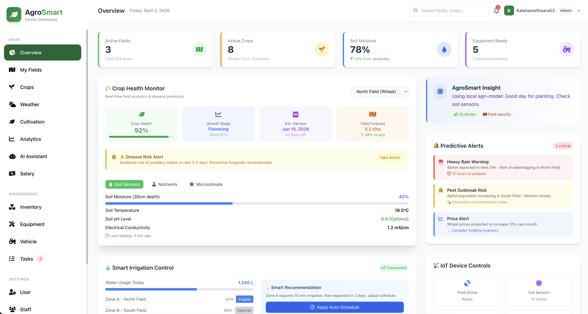
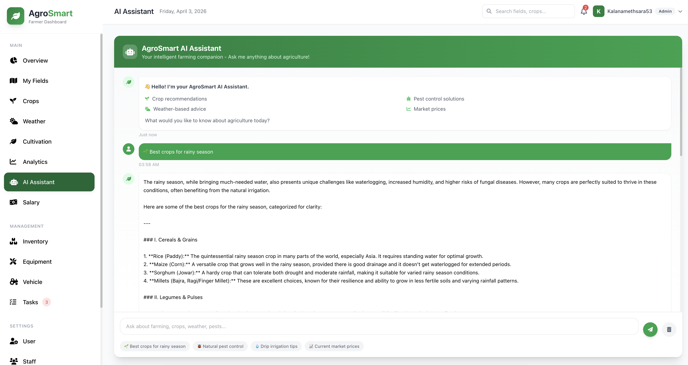
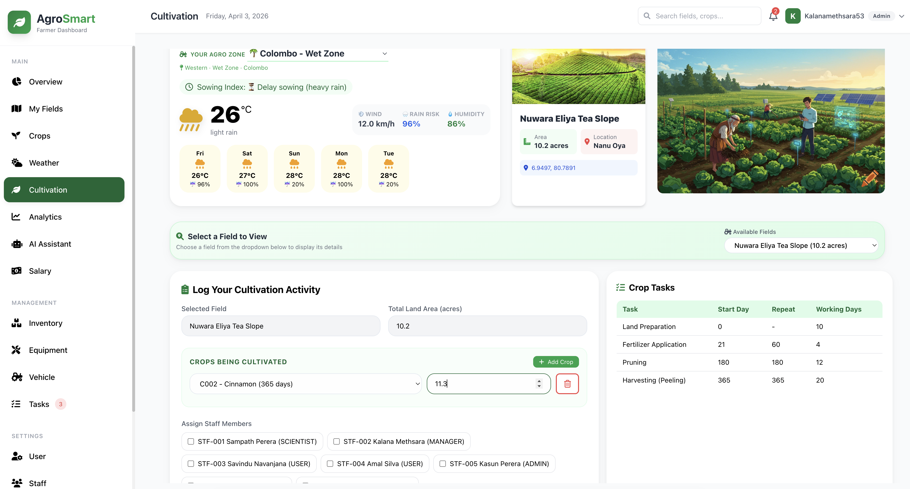
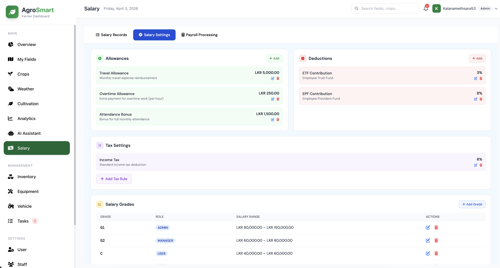

# 🌾 AgroSmart: Enterprise Farm Management System

**AgroSmart** is a cutting-edge, full-stack enterprise solution designed to modernize and digitize agricultural operations. Built on the **Spring Boot** ecosystem, it integrates **Artificial Intelligence (Gemini AI)** and real-time data to help farmers manage land, crops, staff, and financial transactions with precision.

[](https://adoptium.net/)
[](https://spring.io/projects/spring-boot)
[](https://deepmind.google/technologies/gemini/)
[](LICENSE)

---

## 📺 Project Demo & Overview

Watch our comprehensive walkthrough to see AgroSmart in action:

[](https://www.youtube.com/watch?v=x0RjuFCrIn4)

> 🎥 *Click the image above to watch the full demo on YouTube. We cover setup, AI features, and system architecture.*

---

## 🚀 Key Features

### 🍃 Smart Land & Crop Management
| Feature | Description |
|---------|-------------|
| **Field Mapping** | Register and manage multiple land plots with specific soil data and GPS locations. |
| **Crop Lifecycle Tracking** | Monitor planting dates, growth stages, and predicted harvest timelines. |
| **Digital Field Logs** | Record daily activities such as irrigation, fertilization, and pest control. |

### 🤖 AI-Driven Insights (Gemini AI)
- **AI Consultant:** An integrated chatbot powered by **Gemini AI** to diagnose crop diseases and suggest treatments.
- **Predictive Analysis:** Recommends the best crops to plant based on soil history and real-time weather trends.

### 👥 Staff & Payroll Management
- **Workforce Management:** Manage employee profiles, attendance, and task assignments.
- **Automated Payroll:** System-generated salary calculations based on work logs and attendance.
- **Payment Gateway:** Securely process salary disbursements and vendor payments.

### 🔐 Advanced Security & Utilities
- **Spring Security + JWT:** Role-based access control (Admin, Manager, Staff) with secure token-based authentication.
- **Secure Recovery:** Email-integrated "Forgot Password" functionality using SMTP.
- **Weather Integration:** Real-time farming recommendations synced with the **OpenWeather API**.
- **Smart Alerts:** Automated email notifications for low inventory levels and critical weather changes.

---

## 🖼️ System Snapshots

|         Dashboard View          |      AI Consultant Chatbot      |
|:-------------------------------:|:-------------------------------:|
|  |   |
|   *Centralized farm overview* |  *AI-powered crop diagnosis* |

|           Field Management      |         Crop Tracking           |
|:-------------------------------:|:-------------------------------:|
|        |          |
|  *Real-time land monitoring* | *Growth stages & health status* |

|           Field Logs            |       Payroll Management        |
|:-------------------------------:|:-------------------------------:|
|      |      |
|    *Track daily operations* |     *Secure staff payments* |

---

## 🛠️ Tech Stack

| Layer | Technologies |
|-------|--------------|
| **Backend** | Java 17, Spring Boot 3.x, Spring Data JPA, Hibernate |
| **Security** | Spring Security, JSON Web Token (JWT), BCrypt |
| **Database** | MySQL / PostgreSQL |
| **AI Integration** | Google Gemini AI API |
| **External APIs** | OpenWeatherMap API, Stripe/Braintree (Payment Gateway) |
| **Tooling** | Maven, IntelliJ IDEA, Postman, Docker |

---

## 🏗️ System Architecture

The project follows a clean **Layered Architecture** to ensure scalability and maintainability:

1.  **Controller Layer:** Manages REST API endpoints and incoming HTTP requests.
2.  **Service Layer:** Executes business logic, AI processing, and external API calls.
3.  **Repository Layer:** Handles database persistence via Spring Data JPA.
4.  **Entity Layer:** Defines the database schema through Java POJOs.
5.  **Security Filter Chain:** A robust middle-layer that validates JWT tokens and enforces security policies.

---

## ⚙️ Setup & Installation

1. **Clone the repository:**
   ```bash
     git clone [https://github.com/Kalana-methsara/AgroSmart_System.git](https://github.com/Kalana-methsara/AgroSmart_System.git)

## 👨‍💻 Developer
Kalana Methsara University Engineering Student